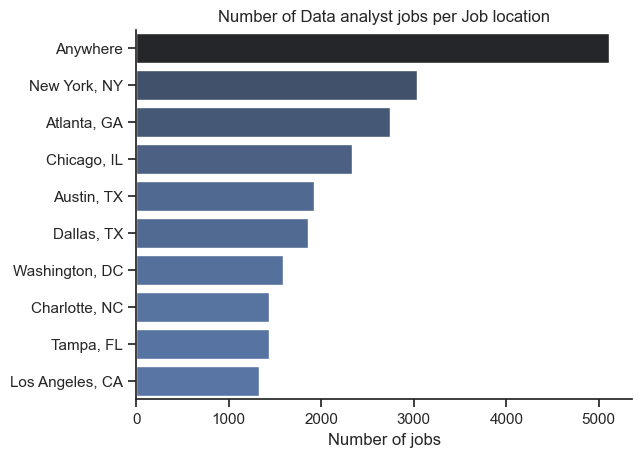
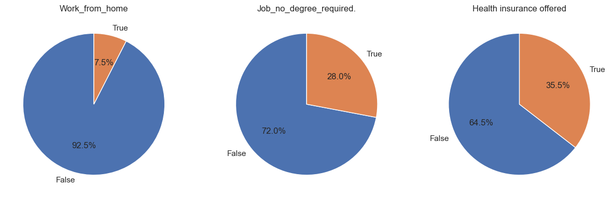
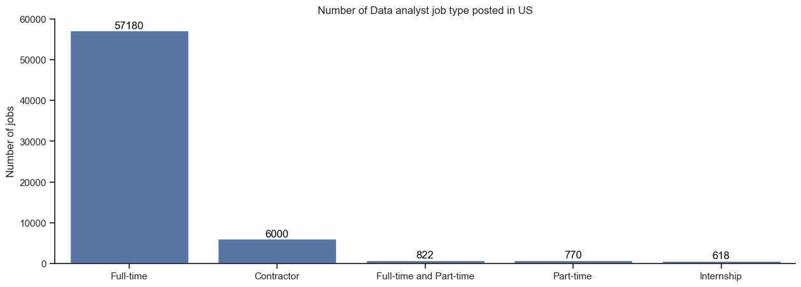
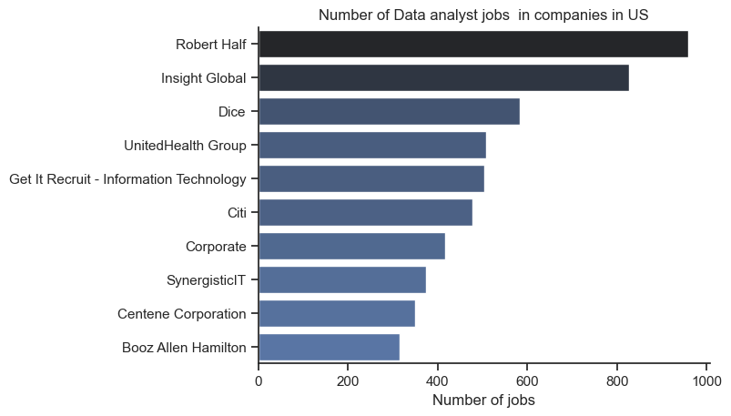
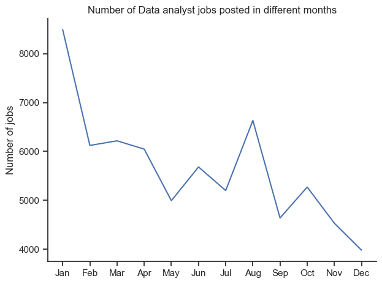

# Overview

Welcome to my analysis of the data job market, specifically targeting data analyst roles. This project stems from a desire to better navigate and comprehend the job market. It examines the top-paying and in-demand skills to help identify the best job opportunities for data analysts.

The data, sourced from [Luke Barousse's Python Course](https://lukebarousse.com/python), serves as the foundation for my analysis, providing detailed information on job titles, salaries, locations, and essential skills. Using a series of Python scripts, I address key questions such as the most demanded skills, salary trends, and the correlation between demand and salary in the data analytics field.

# The Questions

Below are the questions I want to answer in my project:

1. What are the most in-demand skills for the top three most popular data roles?
2. How are the in-demand skills trending for Data Analysts?
3. How well do jobs and skills pay for Data Analysts?
4. What are the optimal skills for Data Analysts to learn? (High Demand and High Paying)

# Tools used

For my in-depth exploration of the data analyst job market, I utilized several key tools:

1.  **Python:** The backbone of my analysis, enabling me to process the data and uncover critical insights. I also used the following Python libraries:
     1. **Pandas Library:** Used for data analysis.
     2. **Matplotlib Library:** Utilized for data visualization.
     3. **Seaborn Library:** Assisted in creating advanced visualizations.
2. **Jupyter Notebooks:** The platform I used to run my Python scripts, which allowed for seamless integration of notes and analysis.
3. **Visual Studio Code:** My preferred editor for executing Python scripts.
4. **Git & GitHub:** Crucial for version control and sharing my code and analysis, facilitating collaboration and project tracking.

# Data Preparation and Cleanup

This section outlines the steps taken to prepare the data for analysis, ensuring accuracy and usability.

## Import & Clean Up Data

I start by importing necessary libraries and loading the dataset, followed by initial data cleaning tasks to ensure data quality.

```python
# Importing libraries
import ast
import pandas as pd
import matplotlib.pyplot as plt
import seaborn as sns
from datasets import load_dataset

# Loading data
data = load_dataset("lukebarousse/data_jobs")
df = data['train'].to_pandas()

# Cleaning data
df['job_posted_date'] = pd.to_datetime(df['job_posted_date'])
df['job_skills'] = df['job_skills'].apply(lambda x: ast.literal_eval(x)if pd.notna(x) else x)
```

## Filter US Jobs

To focus my analysis on the U.S. job market, I apply filters to the dataset, narrowing down to roles based in the United States.

```python
df_us = df[df['job_country'] == 'United States']
```
 
 ## EDA for Data Analyst Jobs in US
In this section, I conducted an Exploratory Data Analysis (EDA) specifically focused on data analyst jobs in the United States. The objective was to gain a comprehensive understanding of the job market, identify trends, and extract meaningful insights.
View my notebook with detailed steps here: [1_EDA](2_PYTHON_PROJECT/1_EDA.IPYNB)

### RESULTS

 


 


 


 


 


### Insights
1. The  first graph shows a significant prevalence of remote data analyst jobs, with "Anywhere" surpassing 5000 opportunities, indicating a strong remote work trend. Among specific locations, New York, NY leads with nearly 3000 jobs, followed by Atlanta, GA, and Chicago, IL, each with around 2500 positions. Other notable cities include Austin, TX, Dallas, TX, and Washington, DC, each offering between 1500 and 2500 jobs. In contrast, Los Angeles, CA, has the fewest openings among the listed cities, with just over 1000 jobs. This highlights a high demand for data analysts in major urban areas and an overwhelming preference for remote positions.
2. The pie charts reveal that only 7.5% of data analyst jobs offer work-from-home options, while a majority (92.5%) require on-site presence. Additionally, 28% of these jobs do not require a degree, indicating that over a quarter of positions are accessible without formal higher education. Regarding benefits, 35.5% of the jobs provide health insurance, leaving a significant 64.5% without this offering, highlighting a potential area for improvement in employee benefits.
3. The third chart above indicates that the vast majority of data analyst job postings in the US are for full-time positions, with 57,180 jobs listed, significantly outnumbering other types. Contractor roles are the second most common at 6,000 postings, while combined full-time and part-time roles, part-time positions, and internships are far less prevalent, with 822, 770, and 618 jobs respectively. This underscores a strong preference for full-time employment within the field.
4. The fourth graph illustrates the number of data analyst jobs available in various US companies. Robert Half and Insight Global lead significantly, offering around 1000 and 900 positions respectively, indicating their strong focus on data analytics. Mid-range companies like Dice, UnitedHealth Group, and Get It Recruit - Information Technology offer between 500-700 job openings, suggesting a substantial but somewhat lower emphasis on data roles. The spread of job numbers across different companies and industries highlights the widespread demand for data analysts across the US job market.
5. The line cgart reveals a clear cyclical pattern in data analyst job postings throughout the year, with a significant peak in January followed by a general downward trend. Notable fluctuations include a spike in August, possibly reflecting mid-year hiring initiatives, while December shows the lowest number of postings. This pattern suggests that companies are most active in hiring data analysts at the start of the year and during late summer.


# The Analysis

Each Jupyter notebook for this project aimed at investigating specific aspects of the data job market. Here’s how I approached each question:

## 1. What are the most demanded skills for the top 3 most popular data roles?

To find the most demanded skills for the top 3 most popular data roles. I filtered out those positions by which ones were the most popular, and got the top 5 skills for these top 3 roles. This query highlights the most popular job titles and their top skills, showing which skills I should pay attention to depending on the role I'm targeting. 

View my notebook with detailed steps here:[2_Skills_demand](2_PYTHON_PROJECT/2_Skills_demand.ipynb)


### Visualize Data

```python
 
 fig, ax = plt.subplots(3,1)


sns.set_theme(style='ticks')

for i,job_title in enumerate(job_titles):
    df_plot = df_skill_percent[df_skill_percent['job_title_short']== job_title].head(5)
    sns.barplot(data=df_plot, x='skill_percent', y='job_skills',ax=ax[i], hue = 'skill_count', palette='dark:b_r')
    ax[i].set_title(job_title)
    ax[i].set_ylabel('')
    ax[i].set_xlabel('')
    ax[i].legend().set_visible(False)
    ax[i].set_xlim(0,80)

    for n,v in enumerate(df_plot['skill_percent']):
     ax[i].text(v,n,f'{v:.0f}%', va= 'center')

    if i != len(job_titles) -1 :
       ax[i].set_xticks([])
     


    plt.tight_layout()
    fig.suptitle('Likelihood of Skills requested in US Job postings', fontsize = 15)

```


### Results


*Bar graph visualizing the top 3 data roles and their top 5 skills associated with each.*

### Insights


• SQL is consistently important across all three roles, appearing in the top two skills for each position.

• Python is highly valued for Data Engineers and Data Scientists, but less so for Data Analysts.

• Specialized tools like Tableau are more relevant for Data Analysts, while cloud platforms (AWS) and big data tools (Spark) are more important for Data Engineers.

• SAS appears as a required skill for both Data Analysts and Data Scientists, but not for Data Engineers.


## 2. How are in-demand skills trending for Data Analysts?
I analyzed job postings for data analyst positions, grouped the skills by the month of the postings, and identified the top 5 skills of Data analyst by month, illustrating the popularity of these skills throughout 2023.
View my notebook with detailed steps here: [3_Skills_trend](2_PYTHON_PROJECT\3_Skills_trend.ipynb).


### Visualize Data

```python
fig, ax = plt.subplots(figsize=(8, 5))

df_plot = df_da_us_percent.iloc[:,:5]

sns.lineplot(data = df_plot, dashes= False, palette='tab10')
sns.set_theme(style='ticks')
sns.despine()


from matplotlib.ticker import PercentFormatter
ax = plt.gca()
ax.yaxis.set_major_formatter(PercentFormatter(decimals = 0))

plt.title('Top trending skills for Data analysts in US')
plt.xlabel('2023')
plt.ylabel('Likelihood in Job postings')
plt.legend(bbox_to_anchor=(1.05, 1), loc='upper left')
```

### Results


*Line chart visualizing the trending top skills for data analysts in the US in 2023.*

### Insights

Here are some insights from the line chart showing the top trending skills for data analysts in the US throughout 2023:

- **SQL** remains the most consistently demanded skill, maintaining a high likelihood in job postings throughout the year, although with a slight downward trend towards the end of the year.
- **Excel** shows a steady presence but experiences a notable decline from mid-year onwards, with a slight recovery in December.
- **Tableau** sees minor fluctuations, with a peak in August and a generally stable trend throughout the rest of the year.
- **Python** maintains a steady demand, with slight increases and decreases, but generally staying around the same level.
- **SAS** is the least demanded among the five skills, showing some minor fluctuations but remaining relatively stable overall.


## 3. How well do jobs and skills pay for Data Analysts?

To determine the highest-paying roles and skills, I focused on job postings in the United States and analyzed their median salaries. Initially, I examined the salary distributions of common data positions such as Data Scientist, Data Engineer, and Data Analyst to understand which roles command the highest pay. View my notebook with detailed steps here:[4_salary_analysis](2_PYTHON_PROJECT/4_salary_analysis.ipynb)


#### Visualize Data 

``` python

sns.boxplot(data = df_us_top6, x='salary_year_avg', y= 'job_title_short', order=job_order)
plt.title('Salary Distribution in United States')
plt.xlabel('Salary Yearly ($ USD)')
plt.ylabel('')

ax = plt.gca()
ax.xaxis.set_major_formatter(plt.FuncFormatter(lambda x,pos: f'${int(x/1000)}K'))

plt.xlim(0,600000)
```

#### Results 


*Box plot visualizing the salary distributions for the top 6 data job titles.*


#### Insights

Here are some insights from the graph titled "Salary Distribution in United States":


- Higher-level positions such as Senior Data Scientist and Senior Data Engineer have higher median salaries and broader salary distributions, indicating a higher variance in pay.
- Data Analyst positions have the lowest median salary and a more compact IQR, suggesting less variability in salaries.
- All roles show some significant outliers, indicating that there are exceptional cases where salaries are much higher than the typical range.


### Highest Paid & Most Demanded Skills for Data Analysts

Next, I narrowed my analysis and focused only on data analyst roles. I looked at the highest-paid skills and the most in-demand skills. I used two bar charts to showcase these.

#### Visualize Data

``` python
fig, ax = plt.subplots(2,1)

sns.set_theme(style='ticks')

#df_da_top_pay[::-1].plot(kind = 'barh', y='median', ax= ax[0], legend=False)
sns.barplot(data =df_top_pay, x = 'median', y= df_top_pay.index, ax=ax[0], hue='median', palette="dark:b_r")
ax[0].legend().remove()
ax[0].set_title('Top 10 highest paid skills for Data analyst')
ax[0].set_xlabel('')
ax[0].set_ylabel('')
ax[0].xaxis.set_major_formatter(plt.FuncFormatter(lambda x,_: f'${int(x/1000)}K'))

#df_da_top_skills[::-1].plot(kind = 'barh', y='median', ax= ax[1], legend= False)
sns.barplot(data =df_top_skills, x = 'median', y= df_top_skills.index, ax=ax[1], hue='median', palette="light:b")
ax[1].legend().remove()
ax[1].set_title(' Top 10 highest in-demand skills for Data analyst')
ax[1].set_xlabel('Median Salary (USD)')
ax[1].set_ylabel('')
ax[1].xaxis.set_major_formatter(plt.FuncFormatter(lambda x,_: f'${int(x/1000)}K'))
ax[1].set_xlim(ax[0].get_xlim())

fig.tight_layout()
```

#### Results


*Two separate bar graphs visualizing the highest paid skills and most in-demand skills for data analysts in the US.*


#### Insights

Here are some general insights from the graphs:

- **High Paying vs. High Demand:** There is a difference between the highest paying skills and the most in-demand skills. While tools like dplyr and bitbucket command high salaries, more traditional tools like Python and SQL are in higher demand.
- **Emerging Technologies:** Skills related to newer technologies (e.g., hugging face, solidity) are highly compensated, indicating niche expertise can yield higher salaries.
- **Essential Skills:** Core data analysis skills (Python, SQL, R) are consistently in high demand and offer competitive salaries.
- **Visualization Tools:** Tools like Tableau and Power BI are both highly in-demand and offer strong salary prospects, emphasizing the importance of data visualization.
- **Traditional Tools:** Despite the rise of new technologies, traditional tools (Excel, Word) remain in high demand, though they tend to offer lower median salaries.


## 4. What are the most optimal skills to learn for Data Analysts?

To identify the most optimal skills to learn ( the ones that are the highest paid and highest in demand) I calculated the percent of skill demand and the median salary of these skills. To easily identify which are the most optimal skills to learn. 

View my notebook with detailed steps here: [5_Optimal_Skills](2_PYTHON_PROJECT\5_Optimal_skills.ipynb)


#### Visualize Data
``` python

from adjustText import adjust_text

df_skills.plot(kind = 'scatter',x = 'skill_percent', y= 'median_salary')
ax =plt.gca()

texts = []
for i,text in enumerate(df_skills.index):
    texts.append(plt.text(df_skills['skill_percent'].iloc[i],df_skills['median_salary'].iloc[i],text))  
adjust_text(texts,arrowprops = dict(arrowstyle= '->', color = 'gray'))


from matplotlib.ticker import PercentFormatter    
ax = plt.gca()
ax.yaxis.set_major_formatter(plt.FuncFormatter(lambda y,pos: f'${int(y/1000)}K'))   
ax.xaxis.set_major_formatter(PercentFormatter(decimals=0))

plt.xlabel('Percent of Data analsyt job')
plt.ylabel('Median yearly salary')
plt.title('Most optimal skills for Data analysts in US')
plt.tight_layout()
```

#### Results


*A scatter plot visualizing the most optimal skills (high paying & high demand) for data analysts in the US.*

#### Insights

Here are some key insights from the graph:

• Python appears to be the most optimal skill for data analysts in the US, offering the highest median yearly salary (around $98K) and being required in about 40% of data analyst jobs.

• SQL is the most commonly required skill, needed in nearly 60% of data analyst positions, though it offers a slightly lower median salary than Python.

• Oracle and SQL Server skills command high salaries but are required in fewer positions (around 10% each).

• Data visualization tools like Tableau and Power BI are moderately common requirements (20-30% of jobs) with salaries in the $90-93K range.

• Excel is required in about 40% of positions but offers a lower median salary compared to more specialized tools.

• General office software skills (Word, PowerPoint) are less frequently required and associated with lower salaries, suggesting they are baseline expectations rather than distinguishing skills.

• There's a general trend that more specialized or technical skills (like Python, Oracle, SQL) tend to offer higher salaries than more general business tools.

• The graph suggests a mix of programming, database, and visualization skills are valuable for data analysts in the US job market.


### Visualizing Different Techonologies

Let's visualize the different technologies as well in the graph. We'll add color labels based on the technology (e.g., {Programming: Python})

#### Visualize Data
``` python
from adjustText import adjust_text

#df_plot.plot(kind = 'scatter',x = 'skill_percent', y= 'median_salary')
sns.scatterplot(data= df_plot, x='skill_percent', y = 'median_salary', hue = 'technology')
sns.despine()
sns.set_theme(style='ticks')

texts = []
for i,text in enumerate(df_skills.index):
    texts.append(plt.text(df_skills['skill_percent'].iloc[i],df_skills['median_salary'].iloc[i],text, fontsize=10))  
adjust_text(texts,arrowprops = dict(arrowstyle= '->', color = 'gray'))


from matplotlib.ticker import PercentFormatter    
ax = plt.gca()
ax.yaxis.set_major_formatter(plt.FuncFormatter(lambda y,pos: f'${int(y/1000)}K'))   
ax.xaxis.set_major_formatter(PercentFormatter(decimals=0))

plt.xlabel('Percent of Data analsyt job')
plt.ylabel('Median yearly salary')
plt.title('Most optimal skills for Data analysts in US')
plt.tight_layout()
```

#### Results


*A scatter plot visualizing the most optimal skills (high paying & high demand) for data analysts in the US with color labels for technology.*

#### Insights

Here are key insights from the graph:

• Programming skills, particularly Python, offer the highest median yearly salary (around $98K) and are in high demand (40% of jobs).

• SQL is the most commonly required skill (nearly 60% of jobs) and offers a competitive salary, highlighting the importance of database skills.

• Cloud technologies like Oracle command high salaries but are required in fewer positions (about 10%).

• Analyst tools such as Tableau and Power BI are moderately common (20-30% of jobs) with salaries in the $90-93K range.

• General office tools (Excel, Word, PowerPoint) are less valued, with lower salaries and varying demand.

• There's a clear hierarchy in skill value: programming > databases > analyst tools > general office tools.

• Specialized skills (Python, Oracle, SQL) generally correlate with higher salaries compared to more generic tools.

• The graph suggests a balanced skill set across programming, databases, and analytics tools is optimal for data analysts in the US.

• Data visualization skills (Tableau, Power BI) occupy a middle ground in terms of both salary and job market demand.


# What I Learned

• Python Proficiency: This project honed my Python skills, particularly in leveraging libraries like Pandas for data manipulation and Seaborn/Matplotlib for creating insightful visualizations. These tools significantly improved my ability to perform complex data analysis.

• Data Preprocessing Criticality: I gained a deep appreciation for the importance of meticulous data cleaning and preparation. This foundational step proved essential for ensuring the reliability and accuracy of subsequent analyses.

• Job Market Intelligence: The project illuminated the dynamics of the data analyst job market. By examining the interplay between skill demand, compensation, and job availability, I developed a framework for making informed decisions about skill development and career progression in the tech sector.

• Practical Application of Data Skills: Through hands-on work with real job market data, I bridged the gap between theoretical knowledge and practical application, enhancing my overall competence as a data analyst.

• Strategic Career Planning: This analysis provided valuable insights into aligning personal skill development with market trends, enabling more strategic and targeted career planning in the dynamic field of data analytics.

# Insights


• Skill-Salary Relationship:
  - Advanced skills like Python and Oracle correlate with higher salaries
  - Specialized technical skills generally command better compensation

• Market Dynamics:
  - Demand for skills is constantly evolving
  - Staying current with emerging trends is crucial for career advancement

• Strategic Skill Development:
  - Focus on high-demand, well-compensated skills for optimal career growth
  - Balance between specialized and versatile skills is beneficial

• Technology Preferences:
  - Programming skills, especially Python, are highly valued
  - Database skills (SQL) remain consistently important

• Tool Hierarchy:
  - Technical tools (programming languages, databases) generally outrank general office tools in value
  - Data visualization tools occupy a middle ground in demand and compensation

• Job Market Intelligence:
  - Understanding the interplay of skill demand, salary, and job availability is key
  - This knowledge enables more informed career planning and skill acquisition

• Continuous Learning:
  - The dynamic nature of the field necessitates ongoing skill development
  - Adaptability to new technologies and methodologies is essential

  # Conclusion

  This analysis of the data analyst job market has yielded valuable insights, illuminating key competencies and emerging trends that define this dynamic sector. The findings provide both a comprehensive overview and practical direction for professionals aiming to progress in the field of data analytics. The project underscores several key points:

• Market Intelligence: The research offers a clear picture of in-demand skills and their economic value, serving as a roadmap for career development.

• Skill Prioritization: By identifying high-value competencies, the study helps analysts focus their learning efforts strategically.

• Industry Dynamics: The analysis reveals the fluid nature of skill requirements, emphasizing the need for adaptability in one's career approach.

• Future-Oriented Perspective: This work lays groundwork for ongoing market analysis, recognizing that staying current is crucial in the rapidly evolving data landscape.

• Lifelong Learning: The project reinforces the importance of continuous skill acquisition and refinement to maintain relevance in data analytics.

• Career Strategy: Insights gained provide a framework for making informed decisions about professional development and job opportunities.

This foundation not only enhances current understanding but also sets the stage for future investigations into the ever-changing data analytics field, highlighting the perpetual need for market awareness and skill evolution.